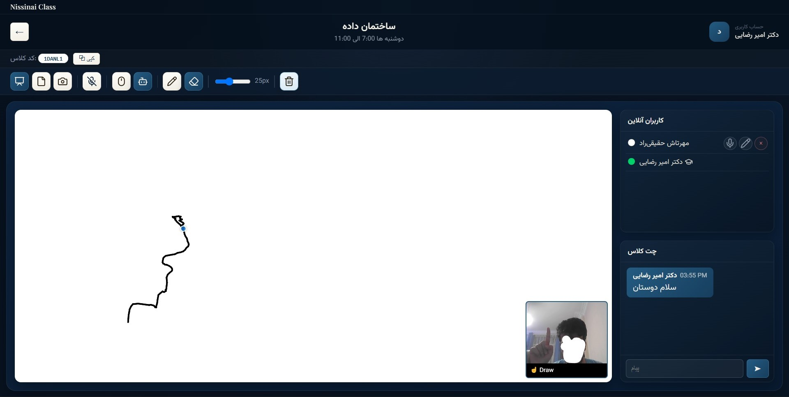

# Nissinai Class

**Nissinai Class** is a client-server smart classroom application — a digital blackboard for teachers and students. Teachers create classrooms, share an invite code, and run live sessions with a collaborative whiteboard, real-time chat, voice communication, and webcam-based hand-gesture drawing. Students join with the invite code, follow along on the shared whiteboard, and request permissions (draw, microphone) from the teacher during the session.

## Features

- **Authentication** — JWT-based login for two kinds of accounts:
  - Pre-registered university accounts (login with a national ID / institutional ID pair)
  - Self-registered guest accounts (email + password), with an optional teacher access code for the teacher role
- **Teacher & Student dashboards** — separate views for creating/managing classrooms and for joining/attending them
- **Classroom management** — create, update, and delete classrooms; join via invite code; membership list; kick a member; leave a classroom; rejoin requests (a removed/left student can request to rejoin, which the teacher approves or rejects)
- **Collaborative whiteboard** — strokes are broadcast over WebSocket in real time and persisted to the database, so a classroom's board survives reconnects
- **Whiteboard permissions** — the teacher grants or revokes draw access per student
- **Microphone permissions** — the teacher grants or revokes mic access per student
- **Hand-gesture drawing** — the whiteboard can be controlled with on-screen hand tracking (via the device camera) instead of, or alongside, mouse/touch input
- **Real-time chat** — per-classroom chat over WebSocket, with history available via a REST endpoint
- **Voice communication** — WebRTC audio between participants, signaled through the same WebSocket connection (offer/answer/ICE exchange)
- **Presence & raise-hand** — live online user list, teacher-online indicator, and a "raise hand" signal for students

## Tech Stack

**Backend**
- FastAPI 0.139.0
- SQLAlchemy 2.0.51 (SQLite)
- Pydantic 2.13.4
- JWT auth via `python-jose`, password hashing via `passlib`/`bcrypt`
- WebSocket (FastAPI native) for real-time sync and WebRTC signaling

**Frontend**
- React 19 + Vite 8
- React Router 7
- Axios
- `@mediapipe/tasks-vision` 1.0.1 for hand-landmark tracking
- `lucide-react` for icons

## Architecture / Project Structure

```
Nissinai-Class/
├── backend/
│   ├── app/
│   │   ├── api/            # FastAPI routers: auth, users, classrooms, chat, websocket
│   │   ├── auth/            # JWT handling, password hashing, current-user dependency
│   │   ├── database/        # SQLAlchemy engine/session setup
│   │   ├── models/          # SQLAlchemy models
│   │   ├── schemas/         # Pydantic request/response schemas
│   │   ├── services/        # Business logic used by the routers
│   │   ├── websocket/       # Connection manager for the classroom WebSocket
│   │   ├── config.py        # Environment-driven settings
│   │   └── main.py          # FastAPI app entrypoint
│   ├── seed.py               # Seeds demo "registered person" accounts
│   ├── requirements.txt
│   └── .env.example
├── frontend/
│   ├── src/
│   │   ├── api/              # Axios client (backend base URL)
│   │   └── pages/            # Login, Register, dashboards, classroom view, etc.
│   ├── public/
│   │   └── models/
│   │       └── hand_landmarker.task
│   ├── package.json
│   └── .env.example
├── README.md
├── .gitignore
└── LICENSE
```

## How It Works

1. **Authenticate** — a user logs in (as a pre-registered university account or a self-registered guest) and receives a JWT.
2. **Dashboard** — teachers land on a dashboard to create/manage classrooms; students land on a dashboard to join classrooms and see which are active.
3. **Classroom** — creating or joining a classroom opens the classroom view, which:
   - opens a WebSocket connection (`/ws/{classroom_id}`) for live sync,
   - loads existing whiteboard strokes and renders them,
   - lets the teacher grant whiteboard/mic permissions to students,
   - relays chat messages, drawing events, and WebRTC signaling to everyone connected.
4. **Gesture drawing** — when enabled, the frontend loads a MediaPipe `HandLandmarker` model in the browser and translates tracked hand landmarks into whiteboard drawing input.

## Requirements

- Python 3.11+ (a version compatible with the pinned dependencies in `requirements.txt`)
- Node.js 18+ and npm
- A webcam and microphone (optional, only needed for gesture drawing / voice features)

## Installation

### Backend Setup

```bash
cd backend
python -m venv .venv
source .venv/bin/activate   # Windows: .venv\Scripts\activate
pip install -r requirements.txt
cp .env.example .env        # then edit .env — see Environment Variables below
```

### Frontend Setup

```bash
cd frontend
npm install
cp .env.example .env        # optional — only needed if the backend isn't on the default address
```

## Environment Variables

**`backend/.env`** (see `backend/.env.example`):

| Variable | Description | Default |
|---|---|---|
| `DATABASE_URL` | SQLAlchemy database URL | `sqlite:///./smart_blackboard.db` |
| `JWT_SECRET_KEY` | Secret used to sign JWTs — set a long random value | *(insecure dev default — override this)* |
| `JWT_ALGORITHM` | JWT signing algorithm | `HS256` |
| `ACCESS_TOKEN_EXPIRE_MINUTES` | Token lifetime in minutes | `180` |
| `TEACHER_REGISTER_CODE` | Code required to self-register as a teacher | *(placeholder — set your own)* |
| `CORS_ORIGINS` | Comma-separated list of allowed frontend origins | `http://127.0.0.1:5173,http://localhost:5173` |

**`frontend/.env`** (see `frontend/.env.example`):

| Variable | Description | Default |
|---|---|---|
| `VITE_API_URL` | Base URL of the backend API | `http://127.0.0.1:8000` |
| `VITE_WS_URL` | Base URL of the WebSocket endpoint | derived from `VITE_API_URL` |

## Running the Project

```bash
# Terminal 1 — backend
cd backend
uvicorn app.main:app --reload

# Terminal 2 — frontend
cd frontend
npm run dev
```

The frontend runs at `http://127.0.0.1:5173` and talks to the backend at `http://127.0.0.1:8000` by default.

## MediaPipe Model

The hand-tracking feature requires `frontend/public/models/hand_landmarker.task`, which is included in this repository. It's loaded directly by the frontend at runtime, alongside the `@mediapipe/tasks-vision` WASM runtime pinned to the same version as the npm dependency.

## Database

The app uses SQLite through SQLAlchemy. Tables are created automatically on backend startup — no manual migration step is required for a fresh checkout. On first startup, `seed.py` populates a small set of **fictional** "registered person" demo accounts (see `backend/seed.py`) so the university-account login flow can be tried out without any real personal data. The local `smart_blackboard.db` file is git-ignored and should never be committed.

## Project Structure

See [Architecture / Project Structure](#architecture--project-structure) above.

## Screenshots

| | |
|---|---|
|  Login |  Teacher dashboard |
|  Create classroom |  Join classroom |
|  Student dashboard |  Whiteboard — freehand drawing |
|  Whiteboard — hand-gesture drawing, live chat, and online users | |

## Limitations / Notes

- This is a university project built for demonstration and portfolio purposes, not a production-hardened deployment. Review and harden the authentication/session handling before any real-world use.
- Hand-gesture drawing relies on `navigator.mediaDevices` camera access and a WebGPU/GPU-capable browser for best performance; behavior may vary by browser and device.
- Voice communication uses WebRTC signaled over the classroom WebSocket; it has not been tested behind restrictive NATs/firewalls without a TURN server.

## License

This project is licensed under the MIT License — see [LICENSE](LICENSE) for details.
